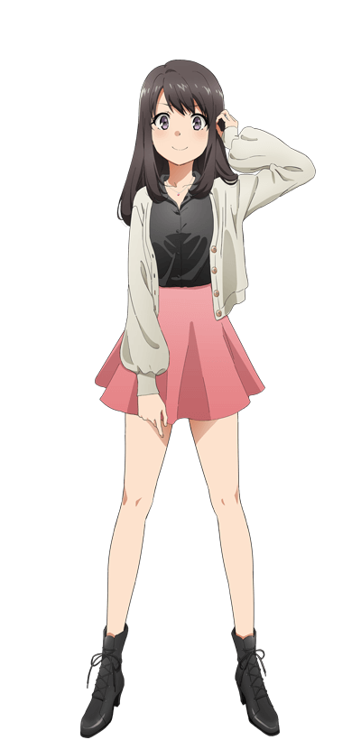
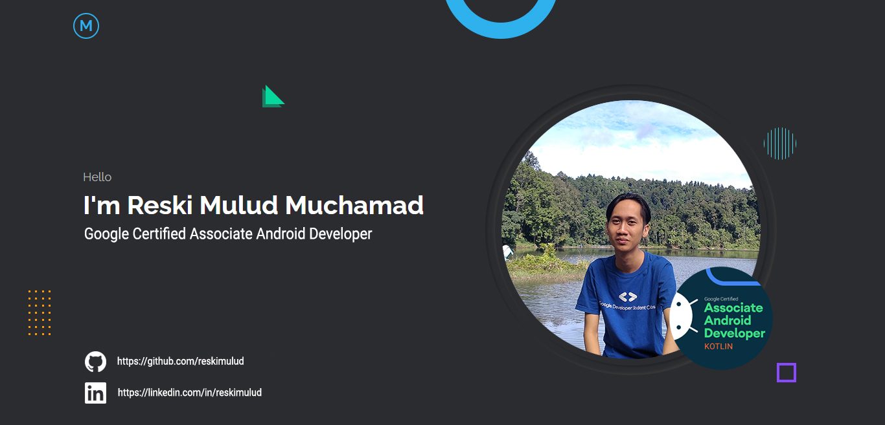
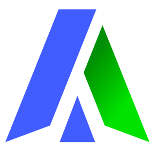

<!-- <div align="center">
    <a href="https://github.com/kawarimidoll/typograssy">
        
    </a>
    <p>
        
        <a href="https://t.me/yoshimakayaba">
            
        </a>
    </p>
</div> -->

<!-- <br>

<div align="center">
    
</div> -->

<!-- <br>
## 🙋‍♂️ Social

  [](https://reskimulud.my.id)&nbsp;
  [](https://linkedin.com/in/reskimulud)&nbsp;
  [](https://instagram.com/reskimulud)&nbsp;
  [](https://www.facebook.com/reskimulud)&nbsp;
  [](mailto:reski.mulud@gmail.com)&nbsp;
  [](https://twitter.com/reskimulud)&nbsp;
  <!-- [](https://twitter.com/reski_mulud)&nbsp; -->
  [](https://wa.me/6386250212)&nbsp;
  [](https://t.me/reskimulud)&nbsp;
  
  <!-- [](https://saweria.co/reskimulud) --> -->

# Tech Stack

### Web Development

  &nbsp;
  
  &nbsp;
  
  &nbsp;
  
  &nbsp;
  
  
  

<!-- ### Mobile Development (Android)

  &nbsp;
  &nbsp;
  &nbsp;

### Machine Learnig

  &nbsp;
  &nbsp; -->
  
### Tools (Databases, IDE, Cloud, Hosting, etc)

  &nbsp;
  &nbsp;
  &nbsp;
  
  &nbsp;
  &nbsp;
  &nbsp;
  &nbsp;


<h2 align="center"> 👁️‍🗨️ About me 👁️‍🗨️ </h2>

```zsh
john@keima: ~/my_readme (main⚡)$ neofetch
```

  -->

```csharp
My Profile ver. 4.3.4: 自由の時期と思春期症候群「じゆうのじきでししゅんきしょうこうぐん」
----------------------------------------------------------------------------------------
Username: Yoshio Keima 「吉尾桂馬」
WhoamI: Physicist and Computer Engineer. Also musician (more or less)
OS: Garuda Linux 'Raptor' with Hyprland
Shell: zsh 5.9
Telegram: @yoshimakayaba.
Fav.Anime(1): 五等分の花嫁 (The Quintessential Quintuplets)💒📕👰🏻
Fav.Anime(2): からかい上手の高木さん (Karakai Jōzu no Takagi-san) 🏞️🚅🌠
Loves: 中野五月 (Nakano Itsuki) (❤️ ω ❤️), videogames 🎮, music 🎹🎶🎵
Pronouns: He/Him
Location: Planet Kepler-452b
Languages: C,C++, Python, Kotlin
Hobbyes: Python, C, C++
Learning: Swift, Kotlin, Go, Js,CSS and HTML
FavouriteSong: Sweeter than wine by NCW
FavouriteEquation: Schrödinger equation
Hobbies: Gaming,watching anime,coding while I am listening music
My.Idols (アイドル): 雨宮天 (Amamiya Sora) || Vocaloid characters || 花澤香菜 (Hanazawa Kana) || 上坂すみれ (Uesaka Sumire)🎤🎶🎼
Dansei.Seiyuu (男性声優): 松岡禎丞 (Matsuoka Yoshitsugu) || 山口光雄 (amaguchi Mitsuo) || 石川界人 (Ishikawa Kaito)
Josei.Seiyuu (女性声優): 高橋李依 (Takahashi Rie) && 水瀬いのり(Minase Inori) || 瀬戸麻沙美 (Setō Asami)

```


<div>
    <br>
    <br>
    <br>
    <br>
    <p align="right">
        <a href = "https://www.youtube.com/watch?v=ziZX0vy8xAM">
            
        </a>
        <b>奏(かなで)CV:高橋李依とCV:雨宮天<br>🎵ふたりはいつもどんな時もつながっていける。🎵</b>
    </p>
    <br>
    <br>
    <p align="left">
        <a href = "https://www.youtube.com/watch?v=oXlEEXws3gc">
            
        </a>
        <b><br><br>高橋李依🎶「共感されなくてもいいじゃない」。🎶🆙</b>
    </p>
    <br>
    <br>
    <p align="right">
        <a href="https://www.youtube.com/watch?v=jC97suFyObw">
            
        </a>
        <b><br>雨宮天🎶「ロンリーナイト・ディスコティック」。🎶💌</b></p>
    <br>
    <br>
    <p align="left">
    <a href="https://youtu.be/b_cuMcDWwsI?si=uaO4V3vYFIG26hrr">
        
    </a>
    <b><br>wowaka 『裏表ラバーズ』feat. 初音ミク。💘🪄💕</b>
    </p>
</div>

<br>
<br>
<br>

<div>
    <h2 align="center"> 🔎Knowledge📖 </h2>
</div>
<div align = "center">
    <p align = "justify">
        I worked using Jupyter Notebook for data analysis and AI focusing on social networks applying graphs theory. Nowdays, I focus on mobile develoment as Kotlin and Swift, also I get some badge about CCNA so I love cyber security.
        So I do my best in every specialtation area. My programming languages are Swift, C/C++, Python, Kotlin, Shell Script, and 
        little bit of CSS and Java Script. In other hand, My knowledge languages are Spanish (Native), English (B2 ~ C1), French (A2),
        German (A1), Japanese (N5 ~ N4). Check my repositories and give your opinion I'll do my best and be better every day. Finally, I love watching anime. 
        <br>
    </p>
    <p align = "center">
         <a href="https://skillicons.dev">
             
        </a>
    </p>
</div>
<br>
<br>
<br>
<br>
<br>
<br>

<h2 align = "center"> 📉 GitHub Stats</h2>
<div> 
    <p align = "center">
        <a href="https://github-readme-stats.vercel.app">
            
        </a>
        <a href="https://github-readme-streak-stats.herokuapp.com">
            
        </a><!--change language to japanese locale=jp-->
        <a href="https://github.com/ryo-ma/github-profile-trophy">
            
            
        </a>
        <a href="https://github.com/ashutosh00710/github-readme-activity-graph">
            
        </a>
        <a href="https://github.com/vn7n24fzkq/github-profile-summary-cards">
            
    </p>
</div>
<br>
<br>
<h1 align="center"> My contributions game 🐍🎮</h1>


<br>

<h2 align ="center"> 📝 Contact me 📝</h2>
<br> 
<div align="center">
    <a href="https://github.com/JohnKun136NVCP" target="_blank">
        
    </a>
    <a href="https://twitter.com/JohnWilliamBn" target="_blank">
        
    </a>
    <a href="https://linkedin.com/in/juan-ang-1307191b0" target="_blank">
        
    </a>
    <br>
    
</div>  
<br>
<div>
    <h2 align="center">Thank you for reading 🙋🏻‍♂️</h2>
    <div align="center">
        
    </div>
</div>
<br> 
<br>

    
<h1 align="center">Support Me 🎧🎤  </h1>

<p align="center">
⠀⠀⠀⠀⠀
</p>


<a href="https://www.buymeacoffee.com/johnkun29" target="_blank"></a>
<!-- # Hi Folks! 



[](https://awesome.re)&nbsp;
&nbsp;
[](https://wakatime.com/@reskimulud)&nbsp;
&nbsp;
&nbsp;
[](https://github.com/reskimulud/reskimulud)&nbsp;
[](https://github.com/reskimulud)&nbsp; -->

<!-- ## I am [Reski Mulud Muchamad](https://reskimulud.my.id)

A Google Certified [**Associate Android Developer**](https://bit.ly/aadreski). Someone who is interested and fascinated to develop Android apps with some experience in Android Development using Kotlin (Android Native) programming language. As a graduate of **Bangkit Academy 2022**, alumni of **Tokopedia Devcamp 2022** and former Lead in the **Google Developer Student Clubs community**. -->

<!-- ### About Me

-  Google Certified [**Associate Android Developer**](https://bit.ly/aadreski)
-  **Tokopedia Devcamp Alumni** Class of 2022 - **Android** Curriculum
-  **Mobile Developer Student** at [_Bangkit Academy 2022 by Google, GoTo, Traveloka_](https://g.co/bangkit)
-  [**Google Developer Student Clubs**](https://gdsc-ummi.tech) _Lead_ at _Universitas Muhammadiyah Sukabumi_

I am a person who really likes new things, and feel challenged about it. I really enjoy exploring and seeking knowledge in the world of computers, gadgets and programming, that's the reason I chose to study Informatics Engineering.

I feel that what my campus teaches is not enough, therefore I continue to seek knowledge outside of lectures, and that is my daily activity.

- 👀 I’m interested in Algorithm, Web Development, Mobile Application, Machine Learning
- 🌱 I’m currently learning about Mobile Apps (Android) and Machine Learning
- 💬 Feel free to ask me about web development or anything
- 📫 How to reach me: [reski.mulud@gmail.com](mailto:reski.mulud@gmail.com)


<!-- # ➕ Extras

  <div align="center">
    
    <br>
    <a href="https://stardev.io/developers/reskimulud"></a>
  </div> -->

# 📈 Github Statistic

<!-- <div align="center">
  <a href="https://github.com/hharshas">
    
    
  </a>
</div> -->

 


[](https://github.com/ryo-ma/github-profile-trophy)

<!-- # 📊 Metrics

<div align="center">


<a href="https://reskimulud.my.id" target="_blank">
  
</a>


</div>

[](https://github.com/reskimulud) -->
